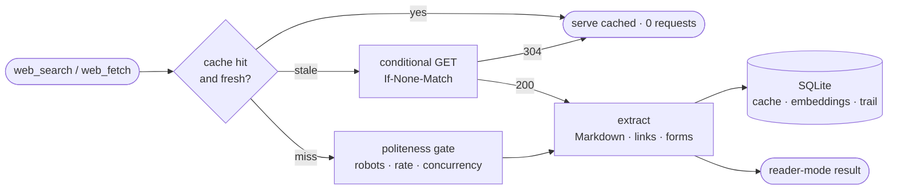

<div align="center">

# Occipital-RS

**The agent's reading cortex — polite eyes on the live web, and a memory of what it read.**

*Search · read · interact · remember. Pure Rust, one binary, one SQLite file, no browser engine.*

[](https://rustup.rs)
[](#-the-tool-surface-9)
[](docs/development.md)
[](#-quick-start)
[](LICENSE)

</div>

---

Give an LLM a raw `curl` tool and it becomes a bad web citizen: it fires off suspicious request
volumes, gets rate-limited or blocked, and dumps 400 KB of navigation chrome into its own
context window. Occipital is the layer in between — a fetch pipeline engineered to be a **good
citizen first**, an extractor that returns clean Markdown instead of HTML, and a knowledge cache
that **decays**, because web content rots.

It speaks **MCP**, **REST**, and **CLI**, runs standalone in any agent stack, and fits in a
single 8 MB binary with no Chromium, no headless browser, and no JavaScript engine anywhere.

```console
$ occipital dom https://html.duckduckgo.com/html/
https://html.duckduckgo.com/html/  DuckDuckGo HTML: Private Search Without JavaScript
snapshot: held

forms:
  #1 POST https://html.duckduckgo.com/html/ — text "q"

$ occipital submit https://html.duckduckgo.com/html/ --form 1 --field "q=polite web scraping"
[form#1 POST https://html.duckduckgo.com/html/ — q=polite web scraping]
[status 200]

## [Rust web scraping: Complete beginner guide](https://www.scrapingbee.com/blog/web-scraping-rust/)
Rust **web** **scraping** explained for beginners: learn how to scrape websites with **Rust**…
```

The agent sees that. So does the human — it's the same view.

## ✨ What's inside

<table>
<tr>
<td width="50%" valign="top">

### 🕊 Polite by construction
Per-registrable-domain token bucket with additive-only jitter, a global concurrency cap,
`Retry-After`-aware backoff, robots.txt with **`Crawl-delay` honored**, and an honest,
identifiable user-agent. Good citizenship — never cloaking, rotation, or evasion.

</td>
<td width="50%" valign="top">

### 📖 Reader-mode, not HTML
Every page comes back as clean Markdown with a resolved link list, so the agent reasons over
signal instead of chrome — and a follow-along UI can render the exact same thing for a human.

</td>
</tr>
<tr>
<td valign="top">

### 🧠 A cache that forgets
Fetched pages are stored, embedded, and lose salience with age and disuse. Search hits the
cache first; only a miss or a stale entry goes live (conditional GET, so a refresh is nearly
free). A GC prunes what nobody read — web content is perishable by default.

</td>
<td valign="top">

### 🖱 Hands, not just eyes
Pages carry an **element registry**: links and forms with stable ordinals. `web_click` follows
`link:3`; `web_submit` fills `form:1` and sends it. GET submissions ride the cache; POST is
deliberate-only, never auto-retried, never cached.

</td>
</tr>
<tr>
<td valign="top">

### 🪄 SPA salvage, without a JS engine
When a page renders client-side, Occipital mines what the static HTML *does* carry —
`__NEXT_DATA__`, state blobs, `ld+json`, `noscript`, meta — and flags `salvaged`. When even
that fails it says **`js_required`** rather than returning a blank page. No script is ever
executed.

</td>
<td valign="top">

### 📊 An honest trail
Every attempt lands in a bounded request log: method, URL, status, **politeness wait**,
duration, and refusals. Occipital *is* the network stack, so observability is a feature, not
an add-on. `occipital log` / `GET /log`.

</td>
</tr>
<tr>
<td valign="top">

### 🔎 Pluggable search
Default is a keyless, polite scrape (DuckDuckGo HTML / SearXNG) so a small node works out of
the box. Keyed providers (Brave · Tavily · Bing) are opt-in, with `0600` key storage and
graceful fallback when a key is missing.

</td>
<td valign="top">

### 🗝 Sessions & identity — opt-in
A persistent cookie jar (off by default) so multi-step flows and operator-provisioned logins
survive a restart, plus per-domain headers and an explicit proxy. **One jar, one identity**;
the honest UA is not overridable, and cross-site `Set-Cookie` is refused.

</td>
</tr>
</table>

## 🚀 Quick start

```bash
git clone https://github.com/buckster123/Occipital-RS
cd Occipital-RS
cargo build --release            # all four crates; no model download, no ONNX
```

Wire the MCP server into any client (Claude Code shown):

```json
{
  "mcpServers": {
    "occipital": {
      "command": "/path/to/target/release/occipital-mcp",
      "env": { "OCCIPITAL_DB": "/path/to/occipital.db" }
    }
  }
}
```

Then ask your agent to search or read something. Nothing else is required — no API key, no
model, no browser.

### Two tiers, one codebase

| | Embeddings | Recall | Build |
|---|---|---|---|
| **Nano** (default) | off — ONNX runtime not even compiled in | FTS5 keyword | `cargo build --release` |
| **Micro+** | `BAAI/bge-small-en-v1.5` | cosine semantic + FTS5 | `cargo build --release --features embeddings` and set `OCCIPITAL_EMBED_MODEL` |

The default build is deliberately small — an **8.3 MB** stripped `occipital-mcp` with no
model download — so a Raspberry Pi-class node runs the full web surface. Embeddings are an
opt-in *build feature*, not just a runtime flag.

## 🧰 The tool surface (9)

| Tool | What it does |
|------|--------------|
| `web_search` | query → ranked results, cache-first; only a miss hits a live provider |
| `web_fetch` | url → reader-mode Markdown + links + forms, with conditional refresh |
| `web_dom` | url → the element registry: links and forms with stable ordinals |
| `web_click` | click by ordinal — `link:N` follows it, `form:N` submits it |
| `web_submit` | fill and submit a form by ordinal (GET cached · POST deliberate) |
| `web_recall` | semantic/keyword search over **already-read** pages — no live request |
| `web_save` | pin a page so decay and GC leave it alone |
| `web_forget` | evict a page from the cache |
| `web_distill` | LLM-curate cached pages into summary · key points · entities · tags |

Every `web_search` / `web_fetch` result is a flat, `kind`-discriminated JSON object that
doubles as a render payload — a UI can show what the agent is reading without a second
channel. Pure-MCP clients simply ignore it.

## 🕊 The politeness contract

This is the differentiator, so it is enforced in code rather than promised in prose:

- **Rate**: 0.5 req/s per registrable domain by default, additive-only jitter (spacing is a
  floor, never an average), 4 in-flight fetches globally.
- **robots.txt**: honored per origin, cached with a TTL, `Crawl-delay` **raises** that
  domain's interval (clamped, and clamping is logged). A refusal is a clean, logged "blocked
  by robots" — not a silent skip.
- **Identity**: one honest, contactable user-agent. Never randomized, never overridable by
  per-domain header rules.
- **Writes**: a POST happens only from an explicit `web_submit` / `web_click` — never from
  extraction, refresh, or retry logic — and is **never replayed automatically**.
- **The cache is the biggest win**: a re-asked query makes zero live requests.

Defaults stay conservative even though every knob is tunable. Full contract:
[docs/politeness.md](docs/politeness.md).

## 🧭 How a read works



Four crates, one library:

```
crates/
  occipital/       # the library — fetch · politeness · extract · salvage · providers · cache · decay · curate · session
  occipital-mcp/   # MCP over stdio — the agent-facing drop-in (9 tools)
  occipital-api/   # axum REST — management + query
  occipital-cli/   # clap CLI — ops, keys, cookies, queries
```

Deeper: [docs/architecture.md](docs/architecture.md) · browsing design:
[docs/agent-browsing.md](docs/agent-browsing.md).

## 🖥 CLI and REST

```bash
occipital search "polite crawlers"        # cache-first search
occipital fetch <url> [--fresh]           # reader-mode Markdown
occipital dom <url>                       # element registry (links + forms)
occipital click <url> link:2              # follow a link by ordinal
occipital submit <url> --form 1 --field q=rust
occipital recall "what did I read about X"
occipital distill [url] [--limit N]       # curate cached pages
occipital log [--limit N]                 # the request trail
occipital cookies list|clear [domain]     # session jar (opt-in)
occipital keys set|list|rm <provider>     # 0600 key store
occipital gc | status
```

REST (`occipital-api`, loopback by default):
`/health` `/stats` `/search` `/fetch` `/dom` `/click` `/submit` `/recall` `/distill` `/save`
`/forget` `/log` `/gc` `/keys`.

## ⚙️ Configuration

Everything is environment-driven with polite defaults; nothing below is required.

| Var | Default | Purpose |
|-----|---------|---------|
| `OCCIPITAL_DB` | `<data_dir>/occipital/occipital.db` | SQLite path |
| `OCCIPITAL_EMBED_MODEL` | `BAAI/bge-small-en-v1.5` | `""` → FTS5-only (Nano) |
| `OCCIPITAL_SEARCH_PROVIDER` | `duckduckgo` | `duckduckgo` \| `searxng` \| `brave` \| `tavily` \| `bing` |
| `OCCIPITAL_RATE_PER_DOMAIN` | `0.5` | requests/sec per registrable domain |
| `OCCIPITAL_MAX_CONCURRENCY` | `4` | global in-flight fetches |
| `OCCIPITAL_RESPECT_ROBOTS` | `1` | honor robots.txt (CLI: `--obey-robots`) |
| `OCCIPITAL_FRESH_TTL_SECS` | `86400` | cache freshness window |
| `OCCIPITAL_COOKIES` | `0` | opt-in session jar (one jar, one identity) |
| `OCCIPITAL_CURATE_BACKEND` | `auto` | distillation LLM: Ollama → Anthropic → `off` |
| `OCCIPITAL_AUTO_DISTILL` | `off` | background curation: `off` \| `local` \| `on` |

Full tables (decay, GC, snapshots, proxy, headers, robots TTL, request log, curation) live in
[CLAUDE.md](CLAUDE.md#environment-variables) and [docs/politeness.md](docs/politeness.md).

## 🧩 Using it with ApexOS-RS

Occipital is **standalone-first** — everything above works in any MCP/REST/CLI stack with zero
ApexOS dependency. [ApexOS-RS](https://github.com/buckster123/ApexOS-RS) is simply its richest
consumer, and shows what a host can build on top:

- **Auto-provisioned**: ApexOS's installer clones, builds, and registers `occipital-mcp` as an
  agentd plugin, choosing the Nano or embeddings build from the node's tier.
- **A follow-along window**: the desktop renders the `kind`-discriminated tool payloads as a
  reader view — the human skims the same Markdown the agent is reasoning over, with a
  LIVE/CACHED badge and a breadcrumb trail of the session.
- **"Go here" steer**: clicking a link (or typing a URL) queues a nudge to the agent, so a
  human can redirect the reading without interrupting the turn.

The web *tools* are Occipital's; the *window* is ApexOS's. That split is deliberate — see
[docs/follow-along.md](docs/follow-along.md) for the contract a host implements, which needs no
new event type and no changes here.

The same family: **[CerebroCortex-RS](https://github.com/buckster123/CerebroCortex-RS)** is the
memory cortex — episodic memory that decays by FSRS/ACT-R. Occipital remembers the *outside
world* (public, fetched, decays by staleness); Cerebro remembers the agent's *own experience*
(private, earned). Different lifecycles → separate databases, same embedding model and storage
idioms, so one node runs both with a single model loaded.

## 📚 Docs

| Doc | For |
|-----|-----|
| [docs/architecture.md](docs/architecture.md) | crate graph, cache/decay model, storage schema |
| [docs/politeness.md](docs/politeness.md) | the full scraping-etiquette contract |
| [docs/agent-browsing.md](docs/agent-browsing.md) | the browsing design — page model, verbs, salvage, sessions, and the JS door |
| [docs/follow-along.md](docs/follow-along.md) | the agent↔UI payload contract |
| [docs/build-roadmap.md](docs/build-roadmap.md) | phased build history with gates (0–16, complete) |
| [docs/development.md](docs/development.md) | building, testing, tiers, conventions |

## 🙅 What it deliberately doesn't do

No JavaScript engine, no headless browser, no CDP server. No UA rotation, header spoofing,
cookie farming, proxy rotation, or CAPTCHA solving. No paywall or login-wall bypass. Pages that
truly require JS come back honestly flagged, and a render sidecar remains a documented door —
not something bolted into the core. If a site says no, we respect it.

## 📄 License

Apache-2.0 — see [LICENSE](LICENSE).

---

<div align="center">
<sub>Politeness and quality are the same axis: a blocked agent is a worse agent.</sub>
</div>
